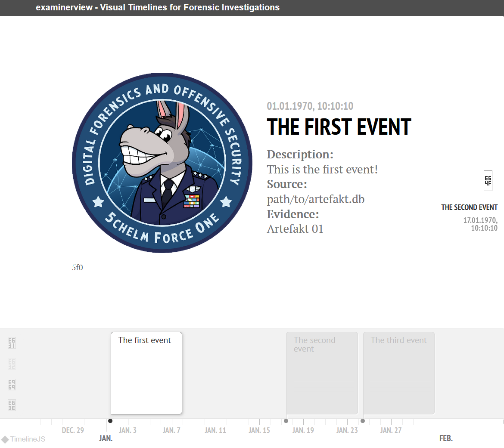

# Description

Create visual timelines for forensic investigations

# Credits

The timeline within the generated HTML file is created by <a src="https://timeline.knightlab.com/"> [TimelineJS3](https://timeline.knightlab.com/) from [KnightLab](https://knightlab.com/). Thank you for your great work.

# Installation

`pip install examinerview`

# Usage

**From command line:**

`python -m examinerview [-h] --data DATA [--output OUTPUT] [--format FORMAT] [--delimiter DELIMITER] [--quotechar QUOTECHAR]`

| Option | Short | Type | Default | Description |
|---|---|---|---|---|
|--data | -d | String | - | Path to csv file |
|--output | -o | String | . | Path to output dir |
|--format | -f | String | %Y-%m-%d %H:%M:%S.%f | Timestamp format |
|--delimiter | -e | String | ; | The delimiter for csv file |
|--quotechar | -q | String | " | The quotechar for csv file |

# Example

In order to generate a timeline, you need to provide a csv file with the following headers:

|timestamp|headline|description|url|caption|evidence|source|
|---|---|---|---|---|---|---|
| Event timestamp (Default Format: YYYY-MM-DD HH:mm:ss.sss) | Headline as a quick description | More text to describe the event | Image url (jpg, png) | Image caption | Name of the evidence | Path to the source 

for the following data:

|timestamp|headline|description|url|caption|evidence|source|
|---|---|---|---|---|---|---|
| 1970-01-01 10:10:10.000 | The first event | This is the first event! | https://avatars.githubusercontent.com/u/96919731?v=4| 5f0 | Artefakt 01 | path/to/artefakt.db 

run `python -m examinerview -d example/timeline.csv` an get `example/examinerview.html`:

# License

MIT